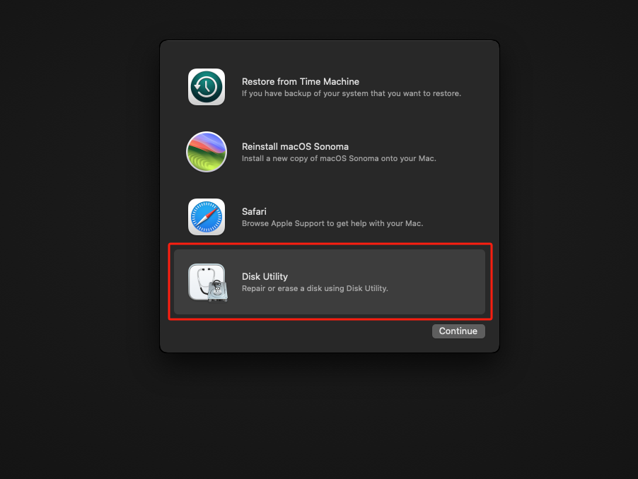
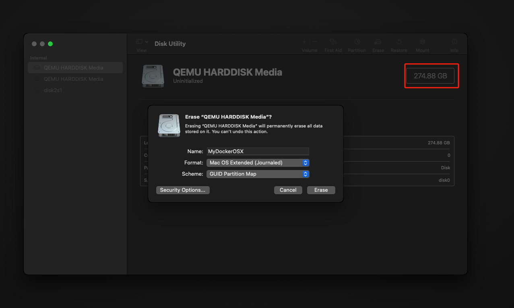

# how to run a macos
## build images
```shell
git clone https://github.com/sickcodes/Docker-OSX.git
cd Docker-OSX
docker build -t sickcodes/docker-osx:sonoma --build-arg SHORTNAME=sonoma .
```
## fine tune the ubuntu
1. 设置wsl参数
go to `C:/Users/<Your_Name>/.wslconfig`, 如果没有就新建, 修改内容为如下
```text
[wsl2]
nestedVirtualization=true
```
2. 检查kvm是否开启
输入`wsl`进入wsl后, 输入`kvm-ok`, 如果已经成功开启, 输出为
```shell
INFO: /dev/kvm exists
KVM acceleration can be used
```
如果没有开启, 输入下面的命令进行安装
```shell
sudo apt -y install bridge-utils cpu-checker libvirt-clients libvirt-daemon qemu qemu-kvm
```
Ubuntu24.04换源
```shell
https://blog.csdn.net/v997282418/article/details/140105030
清华镜像源： https://mirrors.tuna.tsinghua.edu.cn/help/ubuntu/
```
3. 设置docker
在docker desktop中->`设置`->`Resources`->`WSL integration`, 开启`Enable integration with my default WSL distro`
4. 安装x11-apps
```shell
sudo apt install x11-apps -y
```
5. wsl中执行
```shell
sudo docker run -it --device /dev/kvm -p 50922:10022 -e "DISPLAY=${DISPLAY:-:0.0}" -v /mnt/wslg/.X11-unix:/tmp/.X11-unix -e GENERATE_UNIQUE=true -e CPU='Haswell-noTSX' -e CPUID_FLAGS='kvm=on,vendor=GenuineIntel,+invtsc,vmware-cpuid-freq=on' -e MASTER_PLIST_URL='https://raw.githubusercontent.com/sickcodes/osx-serial-generator/master/config-custom-sonoma.plist' sickcodes/docker-osx:sonoma
```
如果需要修改分辨率, 添加参数
```shell
-e WIDTH=2560 -e HEIGHT=1440
```
修改内存
```shell
-e RAM=3
```
修改CPU最大使用量
```shell
-e EXTRA='-smp 6,sockets=3,cores=2' # 表示使用6个逻辑处理器，其中有3个物理处理器，每个处理器有2个核心。
-e EXTRA='-smp 8,sockets=4,cores=2' # 表示使用8个逻辑处理器，配置为4个物理处理器，每个处理器有2个核心。
-e EXTRA='-smp 16,sockets=8,cores=2' # 表示使用16个逻辑处理器，配置为8个物理处理器，每个处理器有2个核心。
```
## 如何重启
```shell
# find last container
docker ps -a

# docker start old container with -i for interactive, -a for attach STDIN/STDOUT
docker start -ai <Replace this with your ID>
```

# 进入镜像后如何操作
1. 进入`macos base system`
2. 在`macOS Utility`选择`Disk Utility`

3. 找到最大的盘进行erase

4. 点×返回到`macOS Utility`选择`reinstall macos`, 点击`continue`

# 如何连接iPhone
1. 下载项目
```shell
sudo apt install avahi-daemon socat usbmuxd
```
```shell
cd /temp
wget https://github.com/corellium/usbfluxd/releases/download/v1.0/usbfluxd-x86_64-libc6-libdbus13.tar.gz
tar -xzvf usbfluxd-x86_64-libc6-libdbus13.tar.gz
cd usbfluxd-x86_64-libc6-libdbus13
sudo systemctl start usbmuxd
sudo avahi-daemon
```
terminal2中执行
```shell
# on host
sudo systemctl restart usbmuxd
sudo socat tcp-listen:5000,fork unix-connect:/var/run/usbmuxd
```
terminal3中执行
```shell
cd /tmp/usbfluxd-x86_64-libc6-libdbus13
sudo ./usbfluxd -f -n
```
